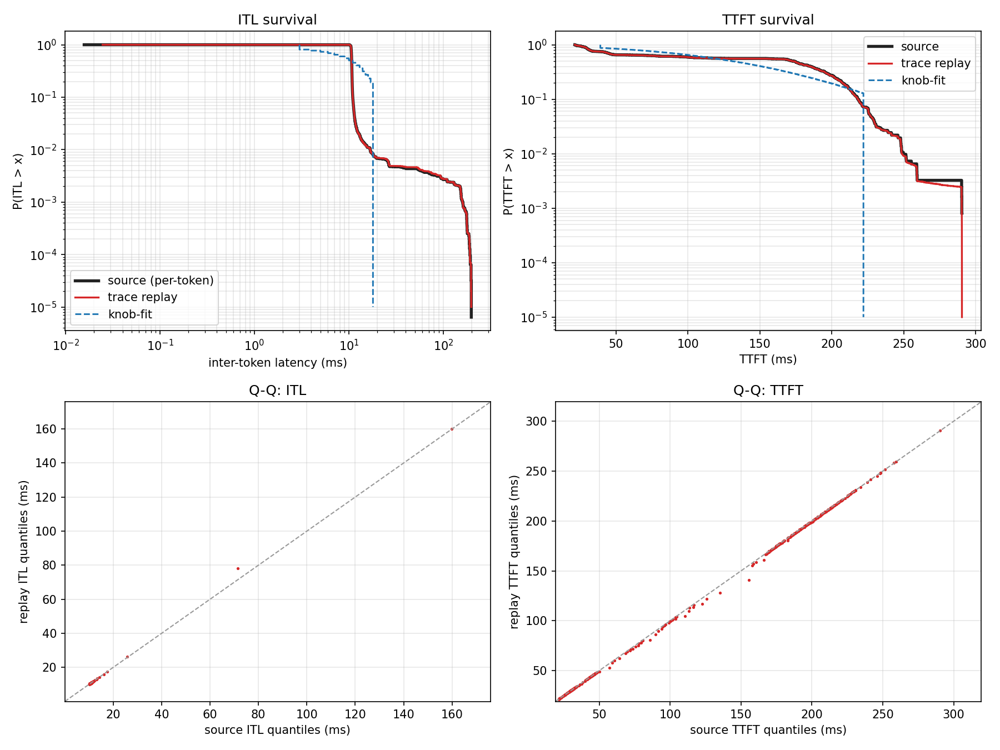
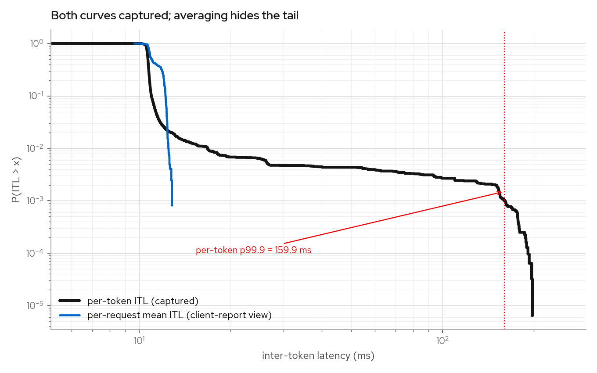
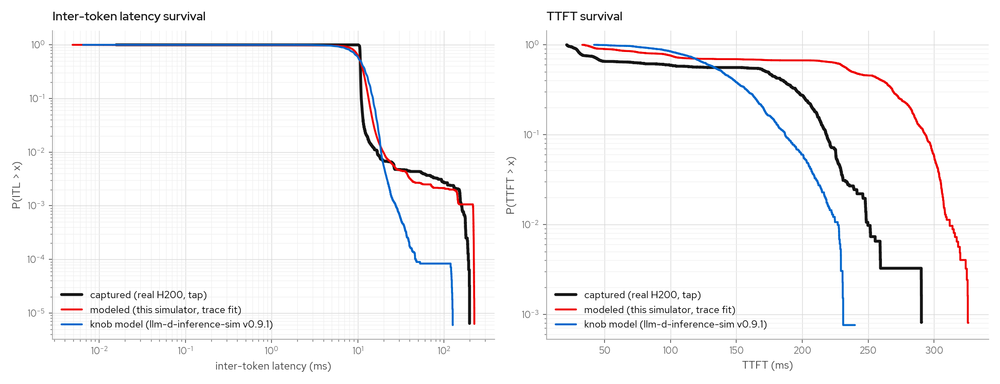
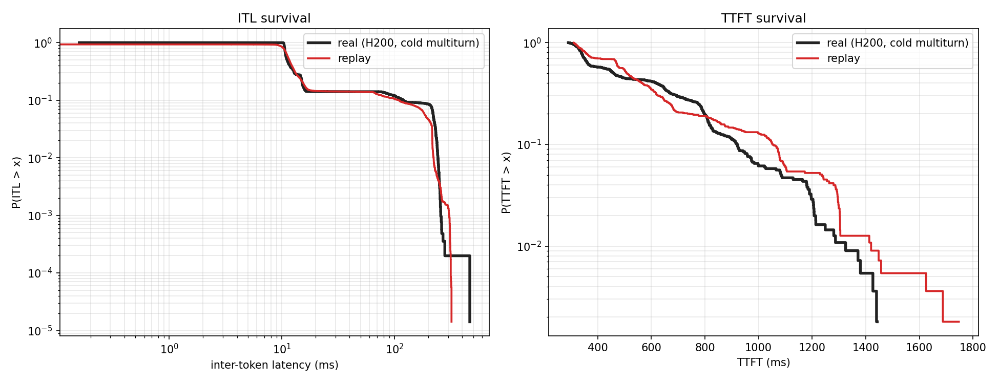
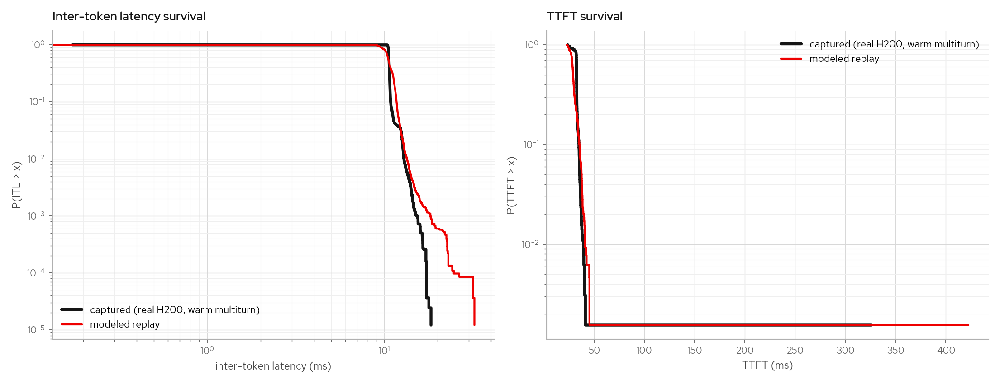
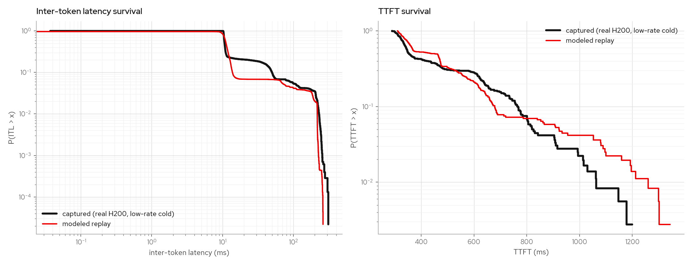
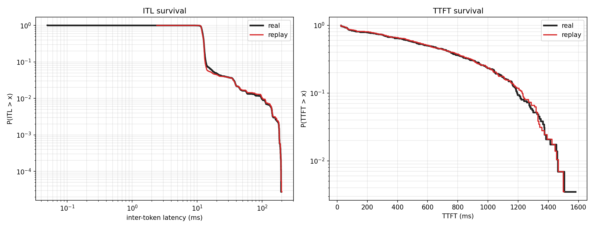
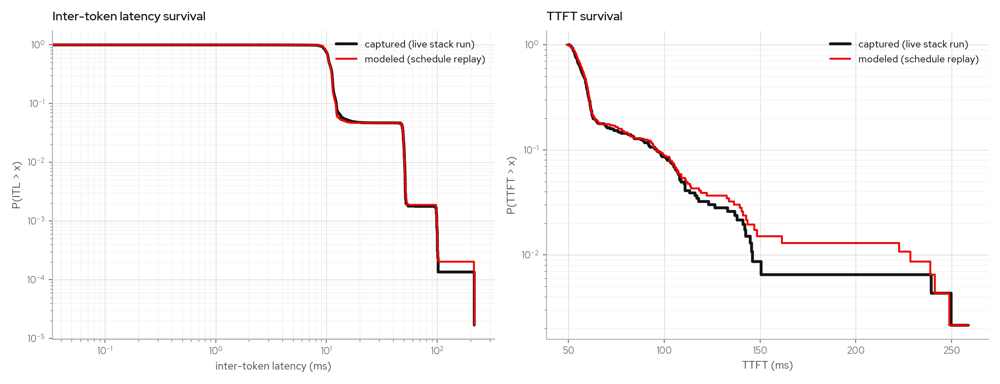
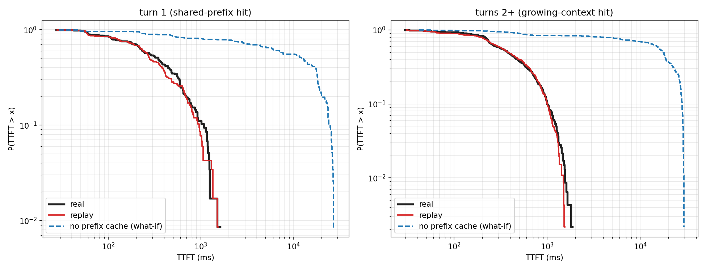

# inference-simulator-rs

A mock vLLM **V1 engine-core** backend that speaks the real ZMQ + msgpack protocol,
with a prefill/decode **KV data plane over NIXL** so you can exercise P/D flows,
including actual byte movement over CPU RDMA / shared memory, **without a GPU or a
model**.

## Table of contents

- [Why](#why)
- [How it works](#how-it-works)
- [Status](#status)
- [Quick start](#quick-start)
- [Testing](#testing)
- [LoRA simulation](#lora-simulation)
- [NIXL data plane](#nixl-data-plane)
- [Hacking the engine](#hacking-the-engine)
- [Trace replay and calibration](#trace-replay-and-calibration)
  - [Concepts](#concepts)
  - [Calibration demo](#calibration-demo)
  - [Calibration against a real engine](#calibration-against-a-real-engine)
  - [Open-loop arrival replay](#open-loop-arrival-replay)
  - [Prefix cache and agentic multiturn](#prefix-cache-and-agentic-multiturn)
  - [Content-identical replay](#content-identical-replay)
  - [Replay pacing](#replay-pacing)
  - [Speculative decoding and diffusion](#speculative-decoding-and-diffusion)
- [Dependencies of note](#dependencies-of-note)
- [License](#license)

## Why

`llm-d-inference-sim` today fakes prefill/decode purely in the control plane: it
adjusts the latency model and tags a finish reason, but no KV cache bytes ever move.
This project takes a different approach on two fronts:

1. **Frontend testing against a real frontend.** Instead of reimplementing the
   OpenAI API surface, sit behind vLLM's *real* frontend (the in-tree Rust frontend,
   or the Python one) as a drop-in engine. The frontend does tokenization, chat
   templates, tool calling, streaming, and the edge cases. Only the model is faked.
2. **A real P/D data path.** The same fake engine moves simulated-KV bytes between a
   prefill instance and a decode instance over
   [NIXL](https://github.com/ai-dynamo/nixl) (UCX backend: DRAM-to-DRAM or real RDMA
   NICs). No CUDA, no GPU.

## How it works

The protocol boundary is reused from vLLM's in-tree `vllm-engine-core-client` crate
(pulled as a pinned git dependency), so the wire format tracks upstream:

```
            ZMQ + msgpack (real engine-core protocol)
 vLLM frontend  ◀──────────────────────────────────▶  inference-simulator-rs
 (Rust or Py)        handshake / ADD / ABORT / UTILITY        │
                                                              ▼
                                              ┌──────────────────────────────┐
                                              │ generation loop (fake tokens) │
                                              │           │                   │
                                              │           ▼                   │
                                              │   KvDataPlane (the boundary)  │
                                              │   • Noop  (default)           │
                                              │   • NIXL  (feature = "nixl")  │
                                              └──────────────────────────────┘
```

- `connect_to_frontend` (from the reused crate) joins the frontend-owned handshake,
  reports ready, and opens the DEALER/PUSH sockets.
- `src/io.rs` decodes frames into `EngineInput` and pushes `EngineOutput` back.
- `src/engine.rs` is the generation loop (random tokens to `max_tokens`), with the
  two data-plane hooks marked `=== DATA PLANE ===`.
- `src/dataplane.rs` is the integration point: prefill **advertises** KV via
  `kv_transfer_params`; decode **pulls** it. `NoopDataPlane` matches today's sim;
  `NixlDataPlane` (behind the `nixl` feature) performs real NIXL transfers.

## Status

- **Protocol:** end-to-end. The vLLM Rust frontend serves streaming and
  non-streaming OpenAI completions through this backend over the ZMQ/msgpack
  protocol, with real tokenizer/detokenizer and chat template, no GPU, no model
  weights, no NIXL. Run `./scripts/e2e.sh`.
- **Control plane (wire-compat):** the engine produces and consumes the vLLM
  NixlConnector `kv_transfer_params` schema
  (`do_remote_prefill`/`do_remote_decode`, `remote_engine_id`/`remote_host`/
  `remote_port`/`remote_block_ids`/`remote_request_id`/`tp_size`/`remote_num_tokens`),
  driven per-request. Exercised against a routing-sidecar emulation
  (`scripts/pd_control.sh`), no NIXL required.
- **NIXL data plane:** the transfer mechanic is implemented and tested in-process
  (`tests/nixl_loopback.rs`: register → NIXL READ → verify, Linux + libnixl).
  Cross-pod pull over the ZMQ metadata side channel (the `get_meta_msg` handshake
  serving `NixlAgentMetadata`) is the remaining increment; the addressing it needs
  (`remote_host:remote_port:remote_engine_id`) is already produced and consumed.

```bash
./scripts/pd_control.sh              # macOS: control-plane schema round trip
cargo check --features nixl-stub     # macOS gate: typecheck the NIXL path
cargo test  --features nixl          # Linux: real NIXL transfer
```

## Quick start

Default build (protocol only, no NIXL, runs anywhere):

```bash
cargo run -- --handshake-address tcp://127.0.0.1:29550 --log-requests
```

Then point a real frontend at the same handshake address (see vLLM's
`rust/src/mock-engine/README.md` for the `vllm-rs serve` / `vllm serve` invocations;
this binary is a drop-in for `vllm-mock-engine`).

Smoke request once a frontend is up:

```bash
curl http://127.0.0.1:8000/v1/chat/completions \
  -H 'Content-Type: application/json' \
  -d '{"model":"Qwen/Qwen3-0.6B","messages":[{"role":"user","content":"hello"}],"max_tokens":16,"stream":true}'
```

The binary is `inference-sim`; the k8s deployment lives in `deploy/llm-d-pd/`.

## Testing

```bash
./scripts/e2e.sh        # boots vllm-rs + this engine, asserts streaming + non-streaming flows
./scripts/e2e_lora.sh   # loads a LoRA adapter, asserts vllm:lora_requests_info names it
```

Needs the `vllm-rs` frontend built once (`cargo build --bin vllm-rs` in the vLLM
`rust/` workspace); override its path with `FRONTEND_BIN=...`. First run fetches the
tokenizer from HF.

`e2e_lora.sh` needs a `vllm-rs` at or past vLLM #45030, which exports
`vllm:lora_requests_info` from the frontend (the engine no longer reports
per-adapter maps in `SchedulerStats`). The pinned commit in `Cargo.toml`/`Dockerfile`
qualifies.

## LoRA simulation

The engine tracks LoRA adapters the frontend loads (`add_lora`/`remove_lora`) and
honors `--max-loras` (distinct adapters allowed in the running batch; `0` = no cap).
In the image, set `MOCK_MAX_LORAS`. The `vllm:lora_requests_info` gauge is
frontend-derived as of vLLM #45030.

## NIXL data plane

The NIXL path needs `libnixl` + UCX installed (Linux; RDMA NICs or shared memory).
On a box without it, typecheck against stubs:

```bash
cargo check --features nixl-stub
```

On Linux with NIXL installed, split a prefill and a decode engine:

```bash
cargo run --features nixl -- --pd-role prefill ...
cargo run --features nixl -- --pd-role decode  ...
```

## Hacking the engine

The engine is split along a trait boundary so you can swap behaviors without
touching the core loop or the ZMQ transport.

**`EngineCore` (src/engine_core.rs)** is the top-level contract. The generic
`run_loop` owns the tokio `select!` over inputs, internal events, and deadline
ticks. Any struct implementing `EngineCore` plugs in unchanged. `SimEngine` is the
production implementation; `ConstantEngine` (test-only, same file) is a from-scratch
engine that reuses the loop.

**Three strategy traits on `SimEngine`** control its behavior without subclassing:

| Trait | File | Default | What it controls |
|---|---|---|---|
| `TokenSource` | `src/tokens.rs` | `RandomTokens` | Which token ids each request emits. `EchoTokens` replays the prompt. |
| `LatencyModel` | `crates/sim-trace/src/latency.rs` | `KnobLatency` | TTFT and inter-token pacing. `FixedLatency` gives constant delays with no rng draws. |
| `Scheduler` | `src/sched.rs` | `Fcfs` | Waiting-queue admission order. `Priority` uses `(priority, arrival_time)`. `ShortestPromptFirst` picks the smallest prompt. |

Defaults are wired in `SimEngine::new` (from CLI flags) and in `run()`.

**Contract tests** live in `tests/engine_core_e2e.rs`. They drive the full stack
(real ZMQ, real protocol framing, real channels) and assert wire-level behavior. If
your change breaks those tests, the wire protocol regressed. Unit tests in
`src/engine.rs` cover engine internals at a finer grain.

## Trace replay and calibration

Captured traces live under `traces/` (gitignored; see
[traces/README.md](traces/README.md) for the inventory and which captures are fitting
vs gate seeds).

### Concepts

Three terms are used precisely throughout this section:

- **Captured** — per-token tap recordings of a real engine, taken server-side on the
  engine-core protocol. The "real" or "source" curve in every figure.
- **Modeled** — latency the simulator emits. TTFT and per-token gaps are drawn from a
  statistical model fitted to a captured trace (conditioned on concurrency, context
  depth, and uncached prompt size). Captured timings are not played back verbatim,
  which lets a model fitted on one workload be evaluated on another.
- **Direct replay** — recorded values used verbatim, no statistics: arrival
  timestamps (`--replay-arrivals`), session pacing (`--replay-sessions`), prefix
  structure (block hashes), and opt-in output token ids (`--replay-tokens`).

"Replay" in a figure or flag name refers to the workload side (the schedule being
replayed), not to the timing. Counterfactual gates fit on workload A, directly replay
workload B's schedule, and check the modeled timing against B's capture.

`just figures` rebuilds every figure in this section from the committed traces
(`scripts/make_figures.sh`; ~30 minutes, the arrival replays run in real time). The
head-to-head comparison is the exception; it needs live serving stacks (commands in
that section).

### Calibration demo

The `inference-sim-trace` binary includes a calibration harness that checks two
properties of the latency models:

1. `TraceLatency` replay reproduces source-trace quantiles within tolerance.
2. `KnobLatency` cannot reproduce heavy tails: its `[0.3*mean, 1.7*mean]` clamp caps
   p99/p50 at roughly 1.7x for any knob settings.

This model-level check is meaningful for ITL and for TTFT on unloaded traces. On real
loaded captures, the TTFT marginal comes from engine mechanics (queueing, chunk
interference) rather than a sampled distribution, so its verdict can FAIL by design
there; loaded TTFT is gated wire-level by the arrival-replay scenarios below.

```bash
# 1. Generate a synthetic heavy-tailed trace (lognormal TTFT/ITL).
cargo run --bin inference-sim-trace -- gen-demo -o /tmp/demo.jsonl

# 2. Model-level calibration (no transport, fast, exact).
cargo run --bin inference-sim-trace -- calibrate /tmp/demo.jsonl

# 3. Wire-level: spin the real simulator and measure client-side.
cargo run --bin inference-sim-trace -- calibrate-e2e /tmp/demo.jsonl --requests 60
```

`--fast` on `gen-demo` produces a small-magnitude trace for quick e2e testing
(TTFT ~15-40ms, ITL ~3-10ms). All subcommands accept `--json` for machine-readable
output and `--seed` for determinism.

### Calibration against a real engine

The recording tap (`inference-sim-tap`, deployment manifests in
[deploy/trace-capture/](deploy/trace-capture/)) sits between the
vLLM Rust frontend and a real headless vLLM engine (Qwen3-8B, TP=1, H200), recording
per-token inter-token gaps server-side over in-pod localhost ZMQ.

The figures below plot captured vs `TraceLatency` vs best-fit `KnobLatency` per-token
ITL (survival curve and Q-Q plot), and the same trace as pooled per-token ITLs vs
per-request mean ITLs (what client-side benchmark reports such as guidellm expose,
since they record only first/last token timestamps). The knob model's
`[0.3*mean, 1.7*mean]` clamp shows up as a vertical cutoff well short of the captured
tail.





To regenerate from any trace with per-token `itl_ms` arrays:

```bash
cargo run --bin inference-sim-trace -- calibrate trace.jsonl --dump-samples samples.json
uv run scripts/plot_calibration.py --samples samples.json --trace trace.jsonl --out-dir docs/images
```

#### Comparison with llm-d-inference-sim

Same workload (`deploy/trace-capture/loadgen.py`, concurrency 1 and 16, 512/128
tokens) against three targets: the real H200 engine (tap-recorded), this simulator
with its latency model fit from the canonical fitting set (a *different* workload, the
counterfactual setting), and the Go
[llm-d-inference-sim](https://github.com/llm-d/llm-d-inference-sim) (v0.9.1) with its
latency knobs fit to this very trace (the in-sample setting). Both simulators ran
natively on the same host, measured client-side by the same load generator; the
real-engine curves are the tap recording. Both simulators' timing is modeled.



The step model's mechanistic TTFT over-predicts this saturated fixed-concurrency
workload by ~70ms at the median (an open calibration gap in the out-of-sample fit).
The knob model clamps both tails by construction.

Note: the trace's std-devs (TTFT 80ms, ITL 8ms) exceed llm-d-inference-sim's config
validation, which caps std-dev at 30% of the mean, so it runs with the largest spread
it accepts (39ms / 3.3ms).

```bash
# llm-d-inference-sim invocation used above
llm-d-inference-sim --port 8001 --model Qwen/Qwen3-8B --mode random \
  --force-dummy-tokenizer --max-model-len 16384 --max-num-seqs 128 \
  --time-to-first-token 132ms --time-to-first-token-std-dev 39ms \
  --inter-token-latency 11ms --inter-token-latency-std-dev 3300us

# this simulator: vllm-rs frontend + trace-fitted model, vLLM-default scheduler
# limits; the fit is the canonical set (sweep + warm multiturn + cold multiturn)
cat traces/h200-qwen3-8b/h200-sweep-full.jsonl \
    <(grep -v '"meta"' traces/h200-qwen3-8b/h200-multiturn-mtfit2.jsonl) \
    <(grep -v '"meta"' traces/h200-qwen3-8b/h200-multiturn-nocache4.jsonl) > /tmp/fit.jsonl
inference-sim --handshake-address tcp://127.0.0.1:5571 \
  --latency-trace /tmp/fit.jsonl \
  --max-num-seqs 1024 --max-num-batched-tokens 8192
```

#### Step-granular interference

The engine paces emission with a step clock that mirrors vLLM's per-step schedule:
decodes claim the shared token budget first, prefills chunk into whatever remains (in
admission order), and every co-running decode's gap is the composed step's duration.
Chunk compute is fitted from the trace as a depth-dependent law (attention makes deep
chunks cost more per token) plus a max-shape premium for budget-saturated steps; small
chunks hide under the batch's decode compute. Queueing, chunk serialization, and decode
elongation emerge from that composer rather than from interference knobs.

The gate is counterfactual: fit on one workload (a constant-load sweep plus a warm
multiturn capture), then predict a cold-cache multiturn (~11k-token prompts, prefix
caching disabled) the model never saw, whose prefill chunks continuously interfere with
running decodes. The real engine spreads that as a two-shelf ITL band; the replay
reproduces the band's shape, mass (13.9% vs 14.1%), and tail.



The warm-multiturn factual leg (99%+ prefix-cache hits) and a low-rate cold leg stay
calibrated under the same model:





The same fit procedure refits from a Qwen3-30B-A3B (MoE) sweep with no constant
changes and reproduces its counterfactual band.

### Open-loop arrival replay

The calibrations above sample the latency model closed-loop, which validates the
*distributions* but never stresses the reactive path: TTFT queueing, prefill stalls,
and concurrency mixing only emerge when an arrival process drives the scheduler.
`calibrate-e2e --replay-arrivals` direct-replays a captured arrival schedule in real
time (each request sent at its recorded offset, open loop) and compares client-side
TTFT/ITL/request-total quantiles against the capture. The arrivals are verbatim; every
latency is still modeled. `--latency-trace` fits the sim's model from a *different*
trace, so the gate runs on an arrival process the model was never fitted on.

Setup: the same frontend → tap → engine stack as the capture rig, run locally with
`inference-sim` as the engine, its latency model fit from the canonical H200 fitting
set. `deploy/trace-capture/loadgen.py --pattern poisson|burst` drives arrival
processes the fitting set never contained.

| scenario                          | requests | concurrency seen | TTFT max err | ITL max err | req-total err |
|-----------------------------------|----------|------------------|--------------|-------------|---------------|
| poisson, 4 req/s                  | 464      | 1-15, median 6   | 36.1%*       | 1.1%        | 0.2%          |
| burst, 24 per 10s                 | 288      | 0 -> 24 spikes   | 0.4%         | 0.05%       | 0.5%          |
| multiturn agentic (see below)     | 495      | 1-13             | 26.0%*       | 0.9%        | 2.5%          |

The max-err columns are the worst single quantile across all concurrency buckets. The
starred cells are small-n tail artifacts: poisson's worst cell is its n=2
concurrency-1 bucket, multiturn's is a warm-TTFT p99 where captured 103ms vs modeled
76ms differ by transport jitter the in-process replay does not model. Medians and p90s
agree within ~1-2%, and request totals stay within 2.5%.

The burst scenario is the harsher test: each burst floods an idle engine with 24
simultaneous 512-token prefills, so TTFT is queueing-dominated (burst TTFT p50 1.2s /
p99 2.0s vs poisson's 58ms / 150ms on the same config).





Per-concurrency-bucket rows shuffle under bursts (admission order inside a burst is not
deterministic), which is why the gate compares pooled quantiles plus per-request decode
totals.

Replayed prompts are unique-token synthetics: the captured workloads carry
`cached_tokens: 0`, and identical fill tokens would silently turn every replayed
request into a prefix-cache hit (this was a real bug). Workloads with genuine prefix
reuse (multiturn/agentic) need the prefix structure replayed too, which is the next
scenario.

To reproduce against any trace with `arrival_ms`:

```bash
# capture: any OpenAI-compatible target
uv run --with httpx deploy/trace-capture/loadgen.py --url http://127.0.0.1:8000 \
  --model Qwen/Qwen3-8B --pattern poisson --rate 4 --duration 120 \
  --prompt-tokens 512 --output-tokens 128 --out run.json --trace-out client.jsonl

# replay the schedule, fitting the model from a different capture
just replay tap-poisson.jsonl /tmp/fit.jsonl

# real-vs-replay survival curves (replay measurements via --dump-trace)
just compare "real=tap-poisson.jsonl" "replay=replay-measured.jsonl"
```

### Prefix cache and agentic multiturn

The agentic scenario (`loadgen.py --pattern multiturn`): sessions arrive poisson at
`--rate`, each runs `--turns` closed-loop turns whose context grows by the turn's
prompt plus the model's response, on top of one of `--prefix-count` shared
`--prefix-tokens` prefixes. The validation run below is ~100 sessions x 5 turns over
two ~10k-token shared prefixes; 493 of 495 requests were prefix-cache hits.

Prefix caching is not a latency knob here. The engine runs a real block-pool prefix
cache; admission computes each request's actual cached-token count, the trace-fitted
TTFT model conditions on the *uncached* prompt size, and a prefill admission stalls
concurrent decodes by its uncached tokens only. The perf gain emerges from workload
structure, which is why replaying it needs the workload's sharing structure: the tap
fingerprints every prompt with chained per-block hashes (`block_hashes`,
mooncake-style), and the replay expands each distinct hash to one deterministic token
block, so replayed prompts share prefixes exactly where the captured ones did.

Two replay modes apply. Pure open-loop replay fires every turn at its recorded offset;
`--replay-sessions` restores the generator's semantics (turn N+1 fires when turn N
completes plus the recorded think gap; sessions are inferred from the hash chains).
Session pacing is the honest mode for closed-loop agentic workloads, and it is what
makes the cache-off what-if below meaningful: cold turns take seconds, so a session
backs off the way the original client would have, where open-loop replay would fire
every turn on the original warm schedule.

The figure shows captured vs modeled TTFT survival per turn cohort (turn-1 requests:
shared prefix hit only; turns 2+: growing context), plus the same schedule replayed
with `--cold-prompts` (prefix reuse defeated). Without the cache, every turn
re-prefills ~11k tokens and offered prefill load exceeds engine capacity: on turns 2+,
TTFT p50 goes from 36ms to ~24s and p99 from 87ms to ~59s, even with closed-loop
sessions backing off.



```bash
# capture an agentic workload (10k-token shared prefixes at ~1.5 tokens/word)
uv run --with httpx deploy/trace-capture/loadgen.py --url http://127.0.0.1:8000 \
  --model Qwen/Qwen3-8B --pattern multiturn --rate 1 --turns 5 \
  --prefix-tokens 6500 --prompt-tokens 128 --output-tokens 128 --duration 120 \
  --out run.json

# session-paced replay (the gate), then the cache-off what-if
cargo run --release --bin inference-sim-trace -- calibrate-e2e tap-multiturn.jsonl \
  --replay-arrivals --replay-sessions --latency-trace /tmp/fit.jsonl \
  --sim-arg=--kv-cache-size --sim-arg=65536 --dump-trace replay-measured.jsonl
cargo run --release --bin inference-sim-trace -- calibrate-e2e tap-multiturn.jsonl \
  --replay-arrivals --replay-sessions --cold-prompts ... --dump-trace nocache-measured.jsonl

# the per-cohort figure
uv run scripts/plot_calibration.py --cache-effect real=tap-multiturn.jsonl \
  --cache-effect replay=replay-measured.jsonl --cache-effect nocache=nocache-measured.jsonl \
  --out-dir docs/images
```

The chunk-cost law behind the cold numbers is the one the cold-multiturn counterfactual
gate validates at this prompt scale, so the collapse is simulated queueing on validated
per-chunk costs rather than an extrapolation. Mooncake-style workload traces (block-hash
ids + lengths + timestamps) map directly onto this schema for replaying production
workloads.

### Content-identical replay

By default the trace schema is share-freely: timing, shapes, and prefix *structure*
(block hashes), never tokens. Opting in with the tap's `--record-tokens` adds each
request's `output_token_ids` (plus `finish_reason`, always recorded) to the trace.
With the same tokenizer those ids decode back to the generated text, so such traces
carry user content.

On the replay side, `inference-sim --replay-tokens <trace>` serves the recorded ids
verbatim instead of random tokens, and ends each stream with the recorded finish
reason. How a request finds its record is `--replay-match`:

- `index` (default): the trailing `-<index>` of the request id, where the index is the
  record's position in the arrival-ordered schedule (the replay harness names requests
  `replay-{i}`). Open-loop: only works when we generate the requests ourselves.
  Combined with arrival replay this makes the simulated engine byte-identical to the
  capture on the wire.
- `prefix`: the incoming prompt's chained block hashes are matched against the records'
  `block_hashes`, longest shared prefix wins, ties go to arrival order, and each record
  is consumed by its first match (a duplicate prompt takes the next duplicate record;
  once all are consumed, retries re-serve the best match). The matched stream ends where
  the capture did: the engine clamps the live request's `max_tokens` to the recorded
  length. This is the closed-loop mode: a real client with its own request ids (an agent
  loop re-run against the sim) gets back the captured streams, and because block hashes
  are chained, noise at the tail of a prompt (a timestamp in the last tool output) only
  shortens the match depth without changing which record wins.

Unmatched requests fall back to random tokens in both modes. Together these give
deterministic streams for testing routers, EPPs, guardrails, and client SDK streaming
behavior without a GPU; in prefix mode, for re-running an entire closed-loop agentic
workload offline (each replayed response is byte-identical to the capture, so a
deterministic agent reconstructs the same next prompt and the loop closes;
`tests/closed_loop_prefix_replay.rs` exercises this shape).

Every trace touchpoint (`--trace-out`, `--latency-trace`, `--replay-tokens`, trace
conversion and replay harnesses) reads and writes gzip transparently when the path ends
in `.gz`; token-recording traces grow by one integer per generated token, so
compressing them is recommended.

### Replay pacing

Content fidelity (`--replay-tokens`) and timing are independent axes, so pacing is knob
composition rather than a mode switch:

| Mode | Invocation |
| --- | --- |
| Timing-modeled | `--replay-tokens trace.gz --latency-trace trace.gz` plus scheduler args matching the capture (`--max-num-seqs`, `--max-num-batched-tokens`, ...): gaps and burst sizes sampled from a model fitted to the trace |
| Timing-verbatim | `--replay-tokens trace.gz --replay-steps trace.gz`: each request replays its exact recorded per-chunk sizes and gaps (the fidelity ceiling; see the spec-decode section) |
| As fast as possible | `--replay-tokens trace.gz` and nothing else: all timing knobs default to 0, the instant model |
| Compressed but shaped | `--replay-tokens trace.gz --latency-trace trace.gz --time-scale 100`: same interleavings and relative ordering, 100x faster wall clock |
| Synthetic timing | `--replay-tokens trace.gz --time-to-first-token 50 --inter-token-latency 10` |

Two knobs for the fast path: the scheduler still runs at zero delay (`--max-num-seqs`
and the token budget produce real queueing and backpressure semantics at infinite
speed; bump them for pure pass-through), and `--output-token-chunk-size` controls output
framing if the client under test should also see multi-token chunks.

### Speculative decoding and diffusion

Speculative decoding (and diffusion, which vLLM serves through the same spec-decode
block path) breaks the one-token-per-step assumption: a single engine step delivers a
*burst* of tokens, 1 verified token plus the accepted drafts, or a whole diffusion
block. The capture and replay path preserves that structure end to end.

On the capture side the tap records, per output chunk, one `itl_ms` gap and the number
of tokens that chunk delivered in a parallel `itl_tokens` array (omitted for plain
autoregressive captures, so old traces are unchanged). The first chunk has no gap; its
size is `output_tokens - sum(itl_tokens)`. With `--step-stats-out` the tap also writes
a per-step `SchedulerStats` sidecar, which under speculative decoding carries
`spec_decoding_stats` (per-position acceptance) straight off the real engine.

There are two ways to put that burst structure back on the wire:

- **Modeled** (`--latency-trace`): the latency model draws the recorded `(gap, tokens)`
  pairs *jointly* from donor pools fitted to the capture. A step the capture saw deliver
  four tokens replays as one four-token message after a *sampled* gap, never four
  messages at gap/4. It reproduces the burst *distribution* (so it transfers to a
  workload it was not fit on), not any request's exact sequence, so expect small
  sampling drift.
- **Replay** (`--replay-steps`): each matched request emits its *own* recorded chunk
  sizes at its own recorded gaps, bit-for-bit (the timing analogue of `--replay-tokens`;
  requests resolve to records via `--replay-match`). This is the fidelity ceiling, exact
  but non-transferable. Use it to validate the pipeline or to drive a downstream consumer
  with a known-exact stream.

Either way the simulator re-derives `spec_decoding_stats` from the bursts it emits
(speculative budget `K = max(itl_tokens) - 1`, a burst of N tokens reported as 1 target
token plus N-1 accepted drafts), so its scheduler stats line up with the capture's.
Autoregressive traces report no spec stats, matching a real engine with speculation off.

```bash
# 1. Capture: real engine with ngram spec decode behind the tap (writes
#    tap-trace.jsonl + step-stats.jsonl). See deploy/trace-capture/ for manifests.
just capture-up && bash deploy/trace-capture/run-capture.sh && just capture-down

# 2. Replay the recorded schedule with verbatim per-request bursts and gaps.
cargo run --release --bin inference-sim-trace -- calibrate-e2e \
    /tmp/trace-capture-h200/tap-trace.jsonl --replay-arrivals \
    --sim-arg=--replay-steps=/tmp/trace-capture-h200/tap-trace.jsonl \
    --dump-trace /tmp/spec-replay.jsonl

# 3. Plot capture vs replay: burst sizes, per-chunk pacing, acceptance.
uv run scripts/plot_calibration.py \
    --spec-fidelity real=/tmp/trace-capture-h200/tap-trace.jsonl \
    --spec-fidelity replay=/tmp/spec-replay.jsonl \
    --spec-steps real=/tmp/trace-capture-h200/step-stats.jsonl \
    --out-dir docs/images
```


The figure is the verbatim `--replay-steps` path (a 4096-record Qwen3-8B run; ngram on
this workload accepts often, so ~45% of steps deliver the full 5 tokens). Left: tokens
delivered per decode step, captured vs replayed. Middle: step time vs burst size;
speculation verifies all K drafts in one target forward pass, so median step time is
~flat in the burst size (~12ms whether the step delivered 1 or 5 tokens), and the dashed
line is the ~gap/N a flattened replay would wrongly produce. Right: per-position draft
acceptance read back from the `SchedulerStats` sidecar (pass a second
`--spec-steps replay=...` to overlay the simulator's own emitted stats). Covered without
a GPU by `tests/spec_replay_fidelity.rs` and `replay_steps`/engine unit tests.

## Dependencies of note

- `vllm-engine-core-client` — pinned git dep on `vllm-project/vllm` (`rev` in
  `Cargo.toml`). Bump the rev to track upstream protocol changes.
- `nixl-sys` — pinned git dep on `ai-dynamo/nixl` (`rev` in `Cargo.toml`), the same
  source the image builds `libnixl` from, so the crate resolves identically on macOS
  (stub) and in the container (real lib).

## License

Licensed under either of [Apache License, Version 2.0](LICENSE-APACHE) or
[MIT license](LICENSE-MIT), at your option.
